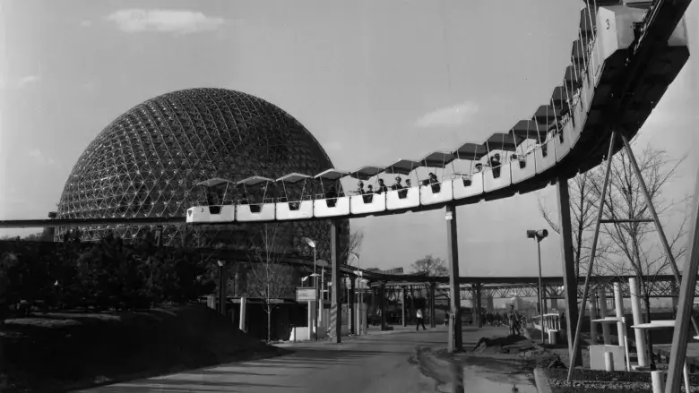

Living somewhere with a winter that's extreme even by Canadian standards has
taught me a lot about how far reaching the cold can be. Its influence spans
everything from the consistency of the snow you walk across to the way you
perceive light. Last year I saw my first [Sun dog], and this year I was lucky
enough to catch the moon with a [22° halo][22 halo].

[Sun dog]: https://en.wikipedia.org/wiki/Sun_dog
[22 halo]: https://en.wikipedia.org/wiki/22%C2%B0_halo

# Lately

## Protobuf Text Format Encoding

It's not super well known, but [Protocol Buffers] have a human friendly [text
format] with something approaching a formal spec[^1]. This lets you write
a schema for your data in typical `.proto` form, and encode/decode
instances of data adhering to that schema expressed in a format very close to
YAML. Being protobuf backed this works great in most major languages. The text
format makes working with the data easy for humans and the schema makes working
with the data easy for programs. This combination of strengths makes it a great
choice for configuration files for projects that already depend on a protocol
buffer compiler for some other reason (e.g. gRPC). In Go you can
marshal/unmarshal to the text format using the
[google.golang.org/protobuf][go-proto] project's [encoding/protobuf] package.
I've been using it for a few things recently and I hope you might find it useful
too.

[Protocol Buffers]: https://developers.google.com/protocol-buffers
[text format]: https://developers.google.com/protocol-buffers/docs/text-format-spec
[go-proto]: https://google.golang.org/protobuf
[encoding/protobuf]: https://pkg.go.dev/google.golang.org/protobuf/encoding/prototext

[^1]: ok, so it's largely EBNF reverse-engineered from the C++ impl. That's
  _Good Enough_ right?

## Pentium III Retro Build

This December I put together an early 2000s retro gaming PC for my partner as
a Christmas gift. It was fun to source old parts from around my area and
working with old hardware was super nostalgic. For the most part I stayed true
to the era but for storage I replaced the contemporary spinning metal IDE drive
with a SD card slotted into a cheap adapter board. This had two big advantages:

1. It's super fast. Windows 98 SE runs like a champ.
2. It's easy to eject the SD card and mount it on a modern computer.

That second advantage was a huge help with installing drivers and other software
without having to make lots of floppy disks and CD ROMs.

For the spec nerds the machine is a slightly tuned up Dell Dimension 4100 (_I'm
a sucker for this era of Dell beige towers_) with a Pentium III clocked at
866mhz, 256mb of PC 133mhz SDRAM, a Nvidia GeForce FX 5200 with 128mb of video
ram, and an Audigy 2 ZS soundcard. It's running Windows 98 SE right now but
should be able to run XP pretty decently too.

# Thinking about

* [The Lost Expo '67 Minirail][Minirail] - even though it was well before my
  time the influence of Expo '67 on Montréal is unquestionable. How could you
  not adore these tiny minirail cars? RIP.
* [@Bobsdecline] - lately I'm obsessed with these day-in-a-life videos from
  a Lineman working on the east coast. Combining high voltage electricity,
  heights, and winter weather leaves so little room for error.
* [Doctor V64] - a cartridge backup device for the N64 from 1996 made by Bung
  Enterprises Ltd. I had no idea this kind of tech was ever marketed to
  consumers outside of niche homebrew/piracy circles. Strange & cool.

[Minirail]: https://www.cbc.ca/radio/thecurrent/montreal-minirail-demolition-1.6662944
[@Bobsdecline]: https://www.youtube.com/@Bobsdecline
[Doctor V64]: https://en.wikipedia.org/wiki/Doctor_V64

# Until next time

