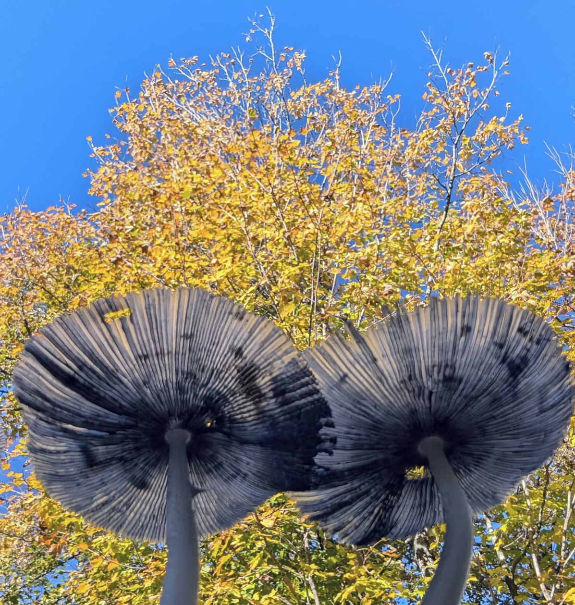
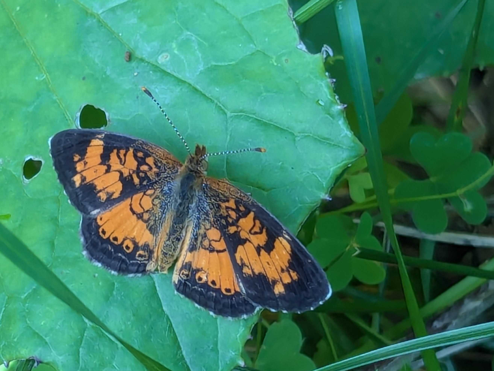

Like a million before me I fell into the most classic of blunders:

1. Overestimating my ability to do interesting work while also writing about it.
2. Letting the time since my last post grow and grow and grow until it became an
   akward burden.

In my experience the only fix is to say "_lol, lmao_" and post through it, so
here we are.

# Lately

## Articles

In an effort to try and make dev log updates light-weight and easier to write
I've started to split out more involved content as [articles] in a different
site category.

So far I've posted two:

1. An [example Nix flake] for a Rust project. In particular I wanted an example
  that supported a project with non-Rust native library dependencies and that
  tested multiple Rust versions (nightly, stable, and an MSRV).
2. A :ghost: SpOoKy October story :ghost: about why your Rust OpenSSL certificate
  generation code might have started [spitting out malformed
  SANs][openssl-rs-sans] one day.

[articles]: /articles
[example Nix flake]: /articles/rust-flake
[openssl-rs-sans]: /articles/openssl-rs-sans/

## Rustls

[Last time] I posted I was new to both Rust, and to contributing to [rustls].

Since then I've been able to land features and bug-fixes across a number of Rust
crates, both those owned by the Rustls org (`rustls`, `rustls-ffi`, `webpki`,
`rustls-platform-verifier`, ...) as well as projects upstream (`aws-lc-rs`, ...)
and downstream (`ureq`, `hyper`, `curl`, `trust-dns`, ...). I'm extremely
grateful to the excellent mentorship I've had from [@ctz], [@djc], [@bdaehlie],
[@jsha], [@complexspaces] and many others. I hope to find time to write more
about some of the interesting bits of work the Rustls team completed over the
past couple of years.

[Last time]: /2023/05/new-and-old
[rustls]: https://github.com/rustls/rustls
[@ctz]: https://github.com/ctz
[@djc]: https://github.com/djc
[@bdaehlie]: https://github.com/bdaehlie
[@jsha]: https://github.com/jsha
[@complexspaces]: https://github.com/complexspaces

## Go FIPS-140-3

I'm spending my remaining full-time work hours in 2024 splitting my time
between Rustls, and an effort lead by [Filippo Valsorda] to obtain a [FIPS 140-3
validation] for Go's standard library crypto packages.

Like most security engineers I think my relationship with FIPS-140 is more of an
"it's complicated" situation. However, a practical mindset demands that the need
be acknowledged. I also think we're overdue for more precedent in the area of
memory-safe FIPS-140-3 certified cryptography libraries that *aren't* Bouncy
Castle.

[Filippo Valsorda]: https://filippo.io/
[FIPS 140-3 validation]: https://github.com/golang/go/issues/69536

## Hire me?

My contracts with [Prossimo] and the Go FIPS 140-3 effort are due to run out
towards the end of 2024. That means I expect to be available[^1] for contract
work, or potentially full-time employment, starting January 2025
(**remote-only**).

If you think my skillset could help you with a project, or if you want to
support the Rustls ecosystem of projects by sponsoring work, please reach out to
`daniel <at> binaryparadox.net`.

[Prossimo]: https://www.memorysafety.org/
[^1]: No on-site or "hybrid" work, cryptocurrencies, blockchains, or web3
    related projects please and thank you...

# Thinking about

<an image>

* [Cryptography 101]. Recently Alfred Menezes has been publishing modern
  cryptography tutorials online. The coverage of [Kyber and Dilithium], (_also
  known by their boring NIST names, "ML-KEM" and ML-DSA"_), is a great place to
  jump in.
* [Twin Cities PBS]. A treasure trove of content. Particular shout-out to the
  fascinating documentaries on [the Baldies] and [Hüsker Dü].
* [Ontario's Computer]. The Burroughs ICON (_A.K.A. the bionic beaver_) is
  unlike anything else. It was a QNX-based UNIX platform sponsored by the
  Ontario government for use in Canadian schools. These were just barely hanging
  on when I was in gradeschool and now that they're unobtanium I'm grateful I got the
  chance to use one as a kid.

[Cryptography 101]: https://cryptography101.ca/
[Kyber and Dilithium]: https://cryptography101.ca/kyber-dilithium/
[Twin Cities PBS]: https://www.youtube.com/@TwinCitiesPBS
[the Baldies]: https://www.youtube.com/watch?v=8BSDZ1DIEIQ
[Hüsker Dü]: https://www.youtube.com/watch?v=_xNcxhKppFM
[Ontario's Computer]: https://jasoneckert.github.io/myblog/icon-computer/

# Until next time

