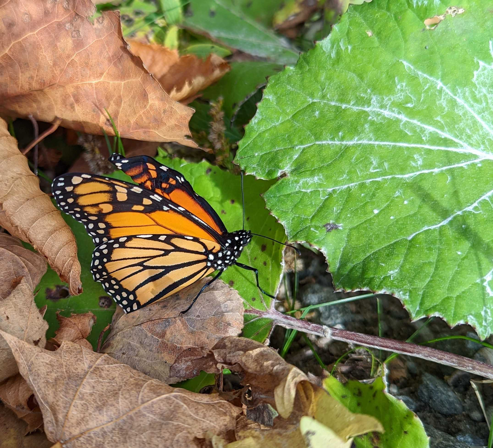
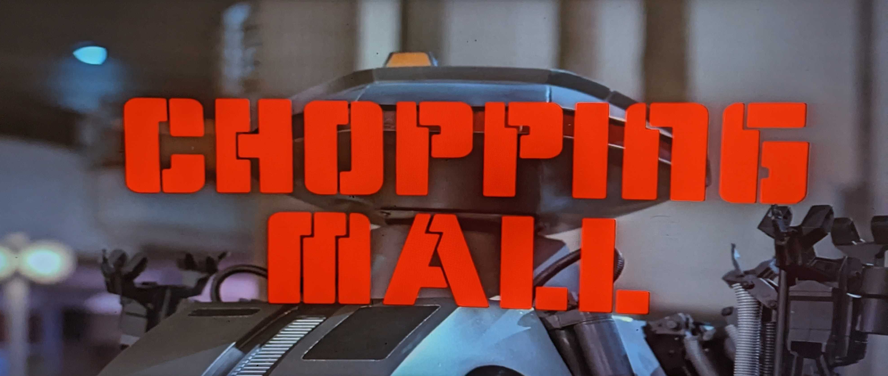

Its been hard to marshal energy to get up to much. The combination of changing
weather, a birthday, and Thanksgiving in short succession makes me a bit of
a slug. Rather than get too hung up on it I've been embracing :jack_o_lantern:
_Spooky October vibes_ :jack_o_lantern: and watching a lot of horror movies
(_some good, most bad_). 

# Lately

Despite being a slug I did find some time for a small project that needs a bit
of backstory.

## Blightmud

### The Backstory

Most [MUD]s are played over Telnet, but using a vanilla Telnet client makes for
a miserable experience. Serious enjoyment requires niceties like scripting and
support for extra protocol additions like [GMCP], TLS, and [charset
negotiation]. Some folks prefer graphical clients, and excellent free software
like [Mudlet] has sprung up in recent years to offer a polished, multi-platform,
graphical MUD client perfect for those people.

Personally I've always preferred terminal clients because of how nicely they
work over SSH paired with [Tmux]. Historically my MUD client of choice (_for 15+
years!_) has been [TinyFugue]. Unfortunately, its development is fragmented, it
uses a custom scripting language (_ugh_) and it's implemented in C (_ugh++_).

Thankfully within the last year I discovered an excellent alternative:
[Blightmud]. It's actively developed, supports TLS, uses Lua for its
scripting language, and is implemented in Rust. What's not to love?

[MUD]: https://en.wikipedia.org/wiki/MUD
[GMCP]: https://nexus.ironrealms.com/GMCP
[charset negotiation]: https://www.rfc-editor.org/rfc/rfc2066
[Mudlet]: https://www.mudlet.org/

[Tmux]: https://github.com/tmux/tmux
[TinyFugue]: https://en.wikipedia.org/wiki/TinyFugue

[Blightmud]: https://github.com/blightmud/blightmud

### In A Bind

Writing [an initial NixPkgs derivation][old-derivation] turned out to be
a little bit challenging because of Blightmud's optional text-to-speech
accessibility feature (_MUDs are quite popular with people that have visual
impairments_). Getting this working requires customizing [rust-bindgen]
and the `LIBCLANG_PATH` so that the Cargo build of the `speech-dispatcher-sys`
crate can find the `speechd` libraries it requires. At the time I wrote the
first derivation I found [Hoverbear]'s [blog post on the
subject][rust-bindgen-nix] and it made this 100x easier to figure out. :superhero:

The derivation has remained mostly unchanged until last week when I discovered
a nice way to clean up all that extra configuration. It turns out the extra
`preBuild` and path fiddling to get `bindgen` configured can be replaced by
a [hook][rust-hooks] that was added to the shared Rust platform framework in
~Feb: `rustPlatform.bindgenHook`.

A quick [cleanup PR] later and the [derivation][new-derivation] is now much
shorter and a lot less custom. It felt good to cut out that complexity and it
was interesting to read through the platform framework implementation of the
hook (_see [here][setup-hook], [here][hook-sh], and [here][wrapper-sh]_) to
compare to the approach I used.

[old-derivation]: https://github.com/NixOS/nixpkgs/commit/ae1bee344a09129db2c13d5564e632934b68cdaf
[rust-bindgen]: https://rust-lang.github.io/rust-bindgen/
[hoverbear]: https://twitter.com/a_hoverbear
[rust-bindgen-nix]: https://hoverbear.org/blog/rust-bindgen-in-nix/

[rust-hooks]: https://github.com/NixOS/nixpkgs/blob/master/doc/languages-frameworks/rust.section.md#hooks-hooks
[cleanup PR]: https://github.com/NixOS/nixpkgs/pull/194525
[new-derivation]: https://github.com/NixOS/nixpkgs/blob/deed43a7257ea861e00d627b98f0e62d2072d790/pkgs/games/blightmud/default.nix
[setup-hook]: https://github.com/NixOS/nixpkgs/blob/b784c5ae63dd288375af1b4d37b8a27dd8061887/pkgs/build-support/rust/hooks/default.nix#L94-L101
[hook-sh]: https://github.com/NixOS/nixpkgs/blob/b784c5ae63dd288375af1b4d37b8a27dd8061887/pkgs/build-support/rust/hooks/rust-bindgen-hook.sh
[wrapper-sh]: https://github.com/NixOS/nixpkgs/blob/8ff7b290e6dd47d7ed24c6d156ba60fc3c83f100/pkgs/development/tools/rust/bindgen/wrapper.sh

# Thinking about

* [Chopping Mall (1986)][chopmall]. Look at that title font! Truly one of the
  least intimidating killer robot designs you could imagine. It's a flop of
  a movie, but I really dig the late 80s mall setting.
* [Hello World under the microscope][microscope]. This work makes other "deep
  dives" look awfully shallow in comparison. Layer after layer of abstractions
  peeled away. :microscope:
* [Fingerprinting systems with TCP source-port selection][fingerprinting].
  A really clever bit of research. It's interesting to see a defensive mechanism
  (_[RFC 6056] source port randomization_) enabling other new attacks.

[chopmall]: https://www.imdb.com/title/tt0090837/
[microscope]: https://gynvael.coldwind.pl/?lang=en&id=754
[fingerprinting]: https://lwn.net/SubscriberLink/910435/8edb2c6f835f960a/
[RFC 6056]: https://www.rfc-editor.org/rfc/rfc6056

# Until next time

:robot::speech_balloon: _THANK YOU, HAVE A NICE DAY_


