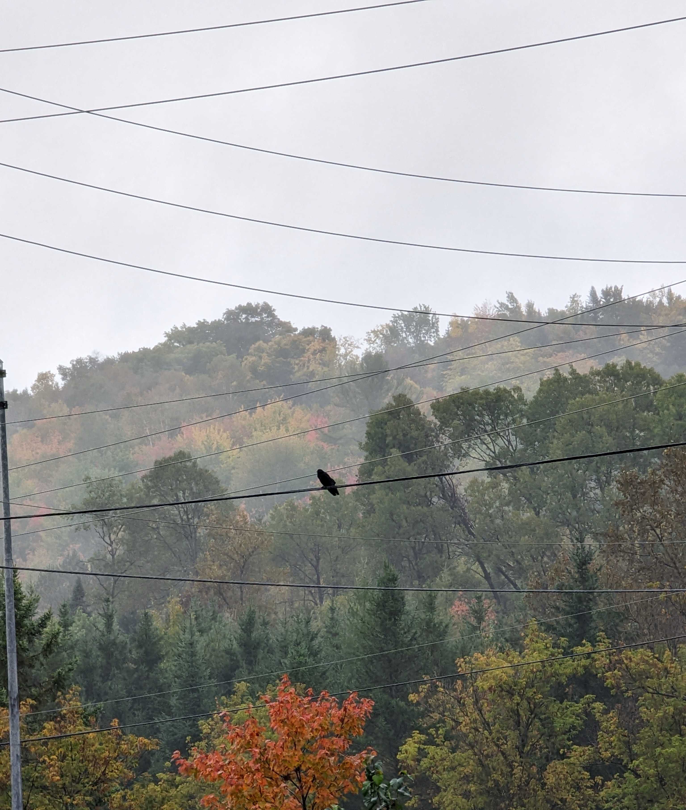

# Starting

I love reading people writing about what they're working on. I hate writing
about what I'm working on. Who would want to read that? Incongruence be damned.

# Fall

Summer is over. That's always a bitter pill to swallow but the colours make up
for it in the short term. Great mushroom hunting too.

# Lately

Here's some stuff I've been up to.

## LDMud Nixpkgs

In ~summer 2021 I got interested in [LPMuds] again. This is a niche within
a niche but the [LPC] programming language was the first language I really _got_
and so it always has a special place in my heart.

My LPMud game engine of choice is [LDMud], a piece of software that can trace
its lineage 30+ years into the past. Refreshingly it's still under active
development and has gained some really cool features recently (including
[Python support][ldmud-py] to bridge LPC/Python).

If MUDs, and LPMuds in particular, weren't niche enough why not add another
dimension: NixOS. Recently I [packaged LDMud 3.6.6 for Nixpkgs][ldmud-nix]. I've
been using this derivation locally for some time for a :sparkles: _secret
project_ :sparkles: and I'm happy it was able to be merged upstream. The [LDMud
copyright] is unique in its non-commercial requirement and so had to be added as
a "non-free" distributable package.

[LPMuds]: https://en.wikipedia.org/wiki/LPMud
[LPC]: https://mud.fandom.com/wiki/LPC
[ldmud]: http://ldmud.eu/
[ldmud-py]: https://github.com/ldmud/ldmud/blob/master/doc/concepts/python
[ldmud-nix]: https://github.com/NixOS/nixpkgs/pull/190682
[LDmud copyright]: https://github.com/ldmud/ldmud/blob/64b3588a13fb0c761da62d6deb56dfa380b03c6f/COPYRIGHT#L10-L14

## VeXation

In January 2019 I started a project called [VeXation], chronicling
my (_very intermittent_) progress writing a from-scratch Windows 95 PE file
infector virus using Borland Turbo Assembler 5. This project has been a lot of
fun, but is also hard to work on in small chunks and so tends to go long periods
of time between updates.

My last post was in April 2021 when I [re-implemented my development
environment][vexation-qemu] with [Qemu]. Since then I actually _did_
make a bit more progress on the virus and implemented a small patch to preserve
the last modified date of infected `.exe`'s. After that I got stuck in the
tarpit that was my [Gatsby] site-generator setup. It was always a bit of a shaky
foundation for me to build on as someone that doesn't actually understand React,
but letting it fall ~2 major versions out of date was the final straw.

Recently I re-implemented the site using [Hugo]. My needs are very
straight-forward and the Go ecosystem is familiar in a way the JS ecosystem is
not. This time around I also wrote [a Nix flake][vexation-flake] to make it
super duper easy to reproduce the entire build environment. The Github [actions
workflow] that publishes the site is pinned to the exact version of Hugo and the
theme I'm using in my local env. Big thanks to [Fernando Ayats]'s "static blog
with hugo and nix flakes" post (_edit: appears gone now!_) for offering a great
starting point to adapt.

Here's hoping all these shaved yaks make it easier to write the next post.
:clown:

[VeXation]: https://log.vexation.ca
[qemu]: https://www.qemu.org/
[vexation-qemu]: https://log.vexation.ca/2021/04/switching-to-qemu/
[Gatsby]: https://www.gatsbyjs.com/
[Hugo]: https://gohugo.io/
[vexation-flake]: https://github.com/cpu/vexation/blob/main/site/flake.nix
[actions workflow]: https://github.com/cpu/vexation/blob/main/.github/workflows/deploy.yml
[Fernando Ayats]: https://ayats.org/

# Thinking about

* The [Wavefunction Collapse Algorithm]. A stupid name for an interesting
  technique for procedurally generating "things" (_textures_, _maps_, _towns_)
  with the same overall vibe as a set of inputs.
* The [Dolphin Progress Reports]. Incredible wizardry. Really great technical
  writing covering said wizardry. I wish every long running free software
  project published reports like these. :heart_eyes:
* The [Outer Limits (1995)][outer limits]. _There is nothing wrong with your
  television set. Do not attempt to adjust the picture._ What if X-Files cross
  Twilight Zone with less money and coherence. Another 1990's production largely
  filmed in BC.

[Wavefunction Collapse Algorithm]: https://robertheaton.com/2018/12/17/wavefunction-collapse-algorithm/
[Dolphin Progress Reports]: https://dolphin-emu.org/blog/
[outer limits]: https://en.wikipedia.org/wiki/The_Outer_Limits_(1995_TV_series)

# Until next time

